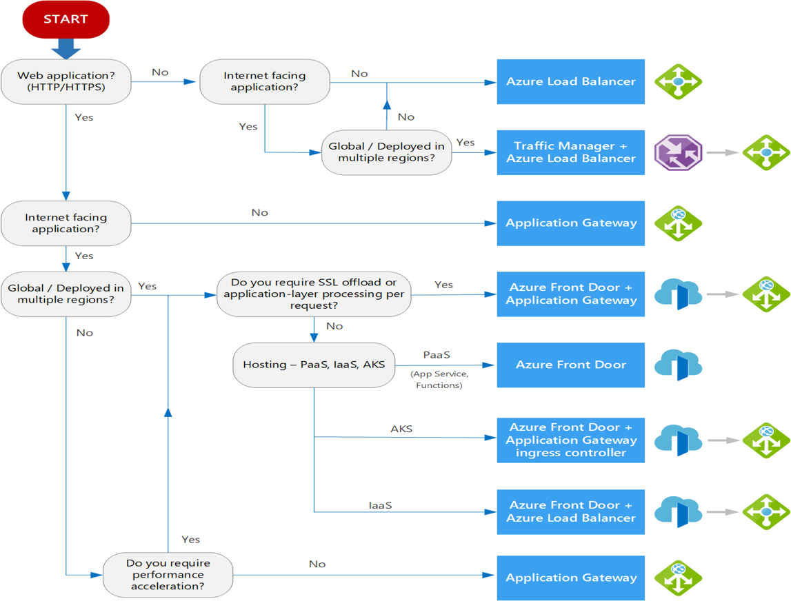

# AZ-305: Microsoft Azure Solutions Architect Certification Exam Notes

## Exam Sections

- Manage Azure identities and governance (15–20%)
  - Configure resource locks.
  - Manage resource groups.
- Implement and manage storage (15–20%)

- Deploy and manage Azure compute resources (20–25%)
  - Configure VM
    - Move VMs from one resource group to another.
- Configure and manage virtual networking (20-25%)
- Monitor and maintain Azure resources (10–15%)

### Resources

- Microsoft Learn Pathway: <https://learn.microsoft.com/en-us/credentials/certifications/azure-solutions-architect/>
- Exam prep videos:

  - [Preparing for AZ-305 - Design identity, governance, and monitoring solutions (1 of 4)](https://learn.microsoft.com/en-us/shows/exam-readiness-zone/preparing-for-az-305-design-identity-governance-and-monitoring-solutions-1-of-4)

  - [Preparing for AZ-305 - Design data storage solutions (2 of 4)](https://learn.microsoft.com/en-us/shows/exam-readiness-zone/preparing-for-az-305-design-data-storage-solutions-2-of-4)

  - [Preparing for AZ-305 - Design business continuity solutions (3 of 4)](https://learn.microsoft.com/en-us/shows/exam-readiness-zone/preparing-for-az-305-design-business-continuity-solutions-3-of-4)

  - [Preparing for AZ-305 - Design infrastructure solutions (4 of 4)](https://learn.microsoft.com/en-us/shows/exam-readiness-zone/preparing-for-az-305-design-infrastructure-solutions-4-of-4)

- [Youtube Playlist](https://www.youtube.com/watch?v=vq9LuCM4YP4&list=PLlVtbbG169nHSnaP4ae33yQUI3zcmP5nP)
- [Microsoft Sample Example](https://learn.microsoft.com/credentials/certifications/exams/az-305/practice/assessment?assessment-type=practice&assessmentId=15)
- [Study Guide](https://learn.microsoft.com/en-us/credentials/certifications/resources/study-guides/az-305)

# Design identity, governance, and monitoring solutions (25–30%)

## Overview

### Core Azure Structure

**Some of these need to be separated into other categories**

- Policy - What can you do
  - Policies can be grouped into initiatives
- RBAC - Who can do it
- Budget - How much

- Azure Blueprint
  - RG's
    - ARM JSON Templates
    - RBAC
    - Policy
  - Can be stored in Sub or Management group
    - Can be applied below that thing
  - Modes:
    - Don't lock - can adjust and delete
    - Don't delete - Can adjust but not delete
    - Read only

- Azure Domain Services
  - If we need to use LTLM or LDAP or Kerberos and we don't have a domain, we'd use Azure Domain Services
  - Creates a managed AD in a virtual network

- AAD Connect - Syncs on prem to cloud AAD (entra connect)

- B2B
  - Add a user as a guest
  - Use their Source provider (google, etc), and it does authentication on that source provider
  - AAD - does the authentication

- B2C (Buisiness to Consumer)
  - Customers can create a local account on the B2C
  - Or use any of a large number of social accounts to login

- Managed Identity
  - System MI
    - Tied with a particular resource
    - Lifecycle is tied directly with resource
  - User Assigned MI
    - Separate lifecycle from a resource
    - Own resource on the tenant
    - Can Grant x resources to use that MI
      - Then can just grant then MI to a permission to the thing that you are giving access to
    - Lifecycle is almost like 1:n
    - Allows multiple resources needing the same permissions to only need 1 MI
    - *EX Q*: You have 10 VM's that all need same set of permissions. What is the minimum number identities you can use
      - You only need 1 MI

- Key Vault
  - Stores:
    - Secrets
    - Keys
    - Certs
  - Now you can now give a MI read access to a secret as one example.
    - So you could have a resource that authenticates to MI, then the MI that can read the secret, and goes to other resources as needed

## Design solutions for logging and monitoring

- Azure Monitor
  - Includes metrics, logs, traces, and changes.
  - Collects data from Data Sources, and can be consumed by other resources like insights (ex: application insights), visualizations (ex: workbooks), analyze (ex: log analytics), and respond (ex: alerts)
  - Can integrate with things like event hubs
- Log Analytics
  - Powers Azure Monitor
    - Azure monitor stores log data in the workspace
  - Data is organized into tables with properties you can query
  - Provides:
    - Geographic location for data storage
    - Data isolation (can grant different users access rights differently)
    - Scope configuration of settings like tier, pricing, retention, data caping

### Monitoring

#### Data is generated from

- AAD
  - Auditing
  - Sign-in logs

- Subscription
  - Activity Log

- Resources
  - Metrics
  - Logs
    - These don't exist by default, have to be configured

- Others
  - Operating systems
  - Application
  - Insight capabilities, etc.

#### Data gets sent to

- Log Analytics Workspace
  - Duration of 2 years
- Event Hub
  - Publish/subscribe service
  - Good for third party
  - Can trigger other things like an azure function
- Storage Account
  - Is cheap retention

- Configuration
  - Driven by diagnostic Settings

- Alert Rules
  - Triggers:
    - Metrics
    - Log Analytics
    - Activity Log
  - Can raise Alerts
    - Alerts can fire Action Groups
      - Action Groups can do things like:
        - API
        - SMS
        - Function

## Design authentication and authorization solutions

- Active Directory Domain Services can use Azure AD Connect (or AD Connect cloud sync for gybrid identity sync) to connect to azure active directory
- Azure Active Directory
  - Internal Users
  - On-Premesis Users
  - Guest Users (B2B/B2C)

- If you need:
  - For employees in cloud or hybrid environment
    - Azure Active Directory (Azure AD)
  - Collaborate with guest users and external business partners like suppliers and vendors
    - Azure AD Business to Business (B2B)
  - Control how customers sign up, sign in, and manage their profiles when they use your applications
    - Azure AD Business to Consumer (B2C)

## Design governance

- Typical Azure hierarchy has 4 levels:
  - Management Groups
  - Subscriptions
  - Resource Groups
  - Resources

# Design data storage solutions (20–25%)

## Design data storage solutions for relational data

- Database Models
  - DTU
    - <https://learn.microsoft.com/azure/azure-sql/database/resource-limits-dtu-single-databases?view=azuresql&WT.mc_id=8B97120A00B57354>
    - Simple, preconfigured purchase option.
    - Combined measure of compute, storage, and I/O resources
    - SKU's
      - Basic (Max 5 DTU's)
      - Standard S0(10 DTU's) - S12(3000 DTU's)
      - Premium P1(125 DTU's) - P15(4000 DTU's)
  - vCore
    - <https://learn.microsoft.com/azure/azure-sql/database/resource-limits-vcore-elastic-pools?view=azuresql&WT.mc_id=8B97120A00B57354>
    - Independent scaling of compute, storage, and I/O resources
    - Provisioned compute
    - Serverless compute

Database scaling strategy. These are key points before choosing vertical/horizontal scaling:

| Requirement | Solution |
| ----------- | -------- |
| Do you have to manage and scale multiple Azure SQL databases that have varying and unpredictable resource requirements? | **SQL elastic pools** |
| Do you have different sections of the database residing in different parts of the world for compliance concerns? | **Horizontal scaling by sharding** works best |
| Are there dependencies, such as commercial Bl or data integration tools where multiple databases contribute rows into a single overall result for use in Excel, Power Bl, Tableau, or Cognos? | Use **Elastic database tools** and elastic query feature within it to access data spread across multiple databases |

- Data Protection
  - Network Security
    - VNet
    - Firewall rules, NSG
    - Private link
  - Identity and access
    - Authentication options: Azure AD, SQL Auth, Windows Auth
    - Azure RBAC
    - Roles and permissions
    - Row level security
  - Data Protection
    - Encryption-in-use
      - Always Encrypted
      - Dynamic data masking (DDM)
        - Hiding data from end user
        - Ex: like if data is this classification, hide all of it except for last 4 number
    - Encryption-at-rest
      - Transparent Data Encryption (TDE)
    - Encryption-in-flight
      - Transport Layer Security (TLS)
      - Restrict Endpoints, etc
    - User-managed keys
  - Security management
    - Advanced threat detection
    - SQL Audit
    - Audit integration with log analytics and event hubs
    - Vulnerability assessment
    - Data discovery and classification
    - Microsoft Defender for Cloud

| Compare | SQL Database | SQL Managed Instance | SQL Server on Azure Virtual Machines |
|---------|--------------|----------------------|--------------------------------------|
| Scenarios | Best for modern cloud applications, hyperscale or serverless configurations | Best for most lift-and-shift migrations to the cloud, instance-scoped features | Best for fast migrations, and applications that require OS-level access |
| Features | Single database - Hyperscale storage (for databases up to 100 TB) - Serverless compute - Fully managed service | Single Instance - (SQL Server surface area via managed instance) - Native virtual networks - Fully managed service | Azure Virtual Machines - (SQL Server access) - OS-level server access - Expansive version support for SQL Server - Fully managed service |
| Elastic pool capabilities | Resource sharing between multiple databases for price optimization - Fully managed service | Instance pool - Pre-provision compute resources for migration - Cost-efficient migration - Host smaller instances (2vCore) - Fully managed service | No elastic pool capability |

- Structured Data
- Column/Rows
- Sql DB
  - Azure SQL Db
    - PaaS (managed solutions)
    - 100TB capacity
    - Autoscaling
    - Service Tiers
      - General Purpose
        - 1 replica
      - Buisness Critical
        - High availability, multiple nodes
        - 3 replicas
      - HyperScale
        - Shard data
        - Can distribute requests over shards of the data
        - Higher set of scale, spread over multiple page servers
        - Multiple replicas
  - Azure SQL Managed Instance
    - PaaS (in Vnet)
    - Better Compat
  - SQL in IaaS VM
    - You manage the whole thing
    - There is a sql server IAAS sql extension
      - Helps w/ automated backup/patching, etc.
      - Sql data migration assistent tool
  - Azure SQL Edge
    - Optimized for IOT
      - Large streams of information
    - Very lightweight (less than 500mb memory footprint)
- Security
  - Classification
    - Azure Purview

## Design data storage solutions for semi-structured and unstructured data

### Semi-Structured

- JSON/XML
- Table
  - Key-Value
- Cosmos DB
  - Multi-Region
    - Consistency
      - Strong - it needs to be conistent in all regions
      - Eventual - It just eventually needs to be consistent in regions
  - API
    - SQL/Mongo DB
    - Cassandra
    - Table - Key/Value
    - Gremlin - Graph

### Unstructured

- Docs/Media

#### Storage account

- BLOB (Binary large object)
  - Block
    - Access Tiers
      - Premium Storage Account
      - Standard Storage Account
        - Hot
        - Cool
        - Archived
          - Is Offline
    - Often for images and multimedia files.

Managed Disk Types Comparison

| Comparison   | Ultra-disk | Premium SSD | Standard SSD | Standard HDD |
|--------------|------------|-------------|--------------|--------------|
| Disk type    | SSD        | SSD         | SSD          | HDD          |
| Scenario     | IO-intensive workloads, such as SAP HANA, top tier databases like SQL Server and Oracle, and other transaction-heavy workloads. | Production and performance sensitive workloads | Web servers, lightly used enterprise applications, development and testing | Backup, non-critical infrequent access |
| Throughput   | up to 2,000 Mbps | up to 900 Mbps | up to 750 Mbps | up to 500 Mbps |
| Max IOPS     | up to 160,000 | up to 20,000 | up to 6,000 | up to 600 |

- Page
  - Good for random read writes
  - Managed Disks
    - STD HDD
      - Performance generally increases with size
    - STD SSD
      - Performance generally increases with size
    - Prem SSD
      - Can change performance separate from size
    - Ultra Disk
      - Has three controls:
        - Capacity
        - IOPS
        - Throughput
  - Append
- Files
  - Full managed file share in the cloud
  - Primarily for SMB
  - NFS also works
  - Azure Files REST API
- Queues
  - FIFO solution
  - Good to create a backlog of work to process asynchronously
- Types of storage accounts
  - Standard General Purpose V2
  - Premium
    - Types
      - Block
      - Files
      - Page
    - Generally high performance, but maybe have less options
      - No GRS options - only LRS or ZRS
- Immuntability
  - Legal holds
  - Time based holds
- Security
  - Access
    - Firewalls
    - IP's
    - VNETs
      - Service/Private endpoints
  - Rights
    - Access Keys - Don't use these
    - Shared Access Signatures
      - But these need to be signed by the access keys (disabling access keys would cause issues)
      - Account Level (files, queues, etc)
      - Service (operations, ips, etc.)
    - RBAC Data

#### Azure Data Lake

- Azure Data Lake Storage Gen 2
- Build on top of Blob storage
- Adds POSIX, etc
- Is a place a bunch of data can go just to store raw data so you can transform it differently later on

## Design data integration

- Replication Options
  - LRS
    - 3 copies of data within one data cluster (building)
  - ZRS
    - 3 copies across data centers
  - GRS
    - 3 copies

### Azure Stream Analytics

- Real-time analytics
- Event processing
- ex: Real-life telemetry streams from IoT devices
- Ingest -> Analyze (Stream Analytics) -> Deliver

### Azure Data Factory

- Source -> ETL (Get data out of somewhere, change it, load it into something else) (Data integration solution) -> Sink
- It is a data orchestration solution
  - 90+ built in connectors
- Create a pipeline
  - Set of activities to achieve a task
    - Consume Data/Tranform Data, etc.
- Self hosted Integration Runtime, that can feed things into azure data factory

# Design business continuity solutions (15–20%)

- Definitions:
  - HA (High Availability)
  - DR (Disaster Recovery)
  - Recovery Time Objective (RTO)
    - How long I need to restore in
    - The maximum amount of time available to bring resources online after an outage or problem.
  - Recovery Point Objective (RPO)
    - How much can I lose
    - The point in time to which a database should be recovered and equates to the maximum amount of data loss that the business is willing to accept.
  - MTTR (Mean Time to Recovery)
    - How long a component can reasonably expect to last between outages
  - MTBF (Mean Time Between Failures)
    - How long it takes to restore a component after a failure

- SQL Server HADR Features for Azure Virtual Machine
  - Always On Failover Cluster Instances (FCI)
    - Protects Instance (the entire installation of SQL Server)
  - Always On Availability Groups (AG)
    - Protects Database (Anything in the database itself, the data)
  - Log Shipping
    - Protects Database (Anything in the database itself, the data)
- Region
  - Has Fault and update domains
    - Fault domains is rack level
    - Update domain helps keep things online when updates happen
  - Availability Sets
    - Distributes work among racks, helps node and rack level failure
    - Create an availability Set for each unique workload
      - if you don't, by bad luck, you whole website may end up on one rack for example
  - Doesn't help building failures
    - Each Building has dedicated power, cooling, networking
  - Availability Zones
    - Logical separations per subscription, not necessarily building 1 is availability zone 1
    - Creates resiliency for a data center failure
    - Synchronous resiliency for replication (less than 2ms)
  - Some services are Zone Redundant
    - Then that server is automatically distributed among multiple availability zones
  - Some services are Zonal
    - You choose which AZ your service lives in. So if you want redundancy, you need to make multiple services in different zones
  - If it's Regional
    - You don't know where in the region it is in
- Make sure you have equal resiliency in all parts of your architecture/solution (otherwise you still have a less resilient point of failure)
- Multiple region solutions
  - Is asynchronous - not synchronous, (can happen up to 15 min after sync?)

- Load Balancing
  - L7 - App Gateway
    - Lives in a region
  - L4 - Standard Load Balancer
    - Lives in a region
  - L7 solution - You can use Azure Front door to load balance between App Gateways
  - L4 - Another solution for not L7 - is traffic manager using DNS
    - Points to multiple load balancers
  - General rules:
    - Balance global solution with regional solution
    - Mix and match layers
      - Ex: If I have L7 App gateway, use L7 Front door in front

## Design solutions for backup and disaster recovery

### Backups

- What do I want to restore? (blob, whole db, etc?) How much data can I loose?

- Azure Backup
  - Has two modes:
  - Can act as an orchestrator
    - Ex: taking snapshots of a blob and keeping certain number of backups
    - Doesn't always make sense to backup blob snapshots (ex) into backup vault into same region
  - There are lots of settings
    - Ex: Azure backup does snapshots, but you can keep some instant snapshots locally for a period of time
  - Storage Vaults:
    - Azure Backup Vault
      - Only used within Azure Backup
    - Azure Recovery Services Vault
      - Can be used with Azure Backup or Azure Site Recovery
  - Can protect on-premises virtual machines
  - Scheduled backups to a storage vault
- Azure Site Recovery
  - Replicates a VM from one region to another
  - Privides continuous replication to a secondary region

## Design for high availability

# Design infrastructure solutions (30–35%)

## Design compute solutions

- Question: Who is responsible for the infrastructure
  - Layers
    - Network
    - Compute
    - Storage
    - HyperVisor (HIV)
    - OS
    - Runtime (RT)
    - App
    - Data

  - OnPrem
    - Self is responsible for all layers
  - Cloud
    - IaaS (Infrastructure as a service)
      - Cloud is responsible for managing HIV, Compute, Storage, Network
      - Self can still manage OS, RT, App, Data
      - Services
        - A VM is the building block of IAAS
          - Consumption based service
        - Batch
          - Create a job - can use N number of VM's just does a job
        - VM Scale Sets (VMSS)
          - I got N number of these websites
            - It creates the VM's
            - Can auto-scale, and auto-delete
        - Azure Container Instance
        - Azure K8's Service
          - Full Orchestration, deployment, auto-scaling pods, auto-scale cluster/nodes, policies, etc
          - Control plane is fully managed
          - Built on VMSS
    - PaaS (Platform as a Service)
      - Self only manages App and Data
      - Cloud provider is reposible for the rest of the layers
      - Services
        - App Service
          - Different SKUs/features
        - Azure Functions
          - Event driven/triggered
          - Can bind to inputs/outputs
        - Logic Apps
          - More a graphical designer rather than code driven for Azure Functions
    - SaaS (Software as a Service)
      - Cloud provider manages all aspects
        - Ex: O365
    - Generally we want to shift right as much as possible (to more managed solutions)
      - So if there is a SaaS, we should choose that over a PaaS
      - While a VM might be more flexible than a PaaS, it also requires the most work. If we can use a PaaS, we should use it.

Compute Decision Tree: <https://learn.microsoft.com/azure/architecture/guide/technology-choices/compute-decision-tree?WT.mc_id=8B97120A00B57354>

## Design an application architecture

- Event
  - Lightweight Notification
- Message
  - Actual data

- Event Hub
  - Large Scale data publishing solution
  - Poll model (something subscribes to hub, and polls things off it)
- Event Grid
  - Sits between event sources and handlers
- Azure Queues
  - FIFO
- Azure Service Bus
  - Richer solution than Azure Queues
  - Can run Queue (1:1)
  - Has Topics
    - You can have subscribers to a topic
      - Service bus will create a copy of the message per subsciber to a topic, so each subscriber can do what it needs with the message
- Azure API Management
  - Can have auth

## Design migrations

- Have to understand what we have and what we want - This drives the desired architecture and migration
  - What is the uses
  - What are the dependencies
  - What are the SLA requirements
  - What are the HA/OR requirements
  - How much am I willing to spend on migration
  - How much am I willing to spend on run

- 4 key types of migrations
  - Rehost
    - Lift and shift
    - Taking what it is now, running it in the cloud
  - Refactor
    - Not changing App code
    - Change sql server from running on IIS to azure sql or postgre, etc
    - Move to an app service or app container
    - Changing some infrastructure
  - Rearchitect
    - Maybe moving to more microservices
      - Requires some code changes
  - Rebuild
    - Start from scratch - building for cloud native solutions
    - This gives more cloud native solution, but is the most work

## Design network solutions

- VNET - One or more IPv4 CIDR ranges (or IPv6)
  - Never overlap CIDR Ranges (between other VNETs, networks OnPrem, Subnets, etc)
    - Can't route
  - Contains one more more subnets
    - Each subnet is a subset of the VNET CIDR Range
    - Each subnet takes 5 IP's of the CIDR range for things like DNS/Gateway, etc
  - For Gateway subnet
    - Generally want a /27 but minimum is /29
  - S2S VPN
  - Express Route Private Peering
  - Can peer multiple VNet's
- NSG (Network Security Group)
  - To Limit communications
  - Contains Rules
  - Can be linked to subnets
- Azure Firewall
  - Can be used to control traffic
  - Traffic has to flow through the firewall
  - Can use user defined routes (UDR) to tell things to use Azure Firewall instead of the normal flow
    - Aka tell traffic to flow through something first before something else
- Service Endpoints
  - Can be put on a subnet
    - Can allow other things to talk to a subnet
    - Optimizes route
- Private endpoint
  - ip from a subnet
  - points to a particular instance of a service
  - Skips a firewall
  - Allows you to block a public ip address, and only get to it from the private endpoint
- Azure Bastion
  - Managed jumpbox
- Azure virtual WAN
  - Managed solution
  - Hub

# Well-Architected Framework

Not being tested on this specifically, but gives a way to think about what good solutions would be.

## Pillars

Pillars of good architecture

### Cost Optimization

- Resource should match demand/load
- Eliminate Waste
- Need insight to make decisions
  - Monitoring, logging, etc.
  - Gives us ideas on what we actually need
  - What are my buisiness requirements?
  - What are my technical requirements?
  - How is it running?
  - Insight can lead me to architecture of solution
- Shape of resource match shape of work
  - vCPU
  - Memory
  - Storage
  - Network
  - Choose the right SKU
    - The right SKU is the one that matches the right shape
- Get the right size (of the shape)
  - Usually N Instances is better than one large instance
- Stop/Deallocating/Deleting
  - Stopping, etc. when we don't actually need it
  - Choosing resources that reduce cost
    - Ex: VMSS, if we can delete a VM so there isn't a storage hanging off of it is even better than just de-allocating a VM and there still being a disk hanging off of it
      - VMSS also gives things like auto-scale
- Insight -> Architecture + Cost
- Pricing Calculator can estimate cost
- How to control cost
- Policy
  - Could say things like can't use big VM's (M seres) in development
- Budgets
  - How much
  - Current cost
  - Forecasted cost
  - Insight
    - Cost analysis
    - Total cost of ownership
      - It might be more expensive to have an Azure Sql Db
      - But you don't have responsibilities of managing a VM, so you are saving money in other ways
- Serverless
  - If I can have something event driven
  - Very efficient
- Spot VM's
  - Pay a lot less, but you may be booted off the vm
  - Way to save money
- Reserved Instances
  - If I know I will have a baseline, (even if I have spikes above it), I can get discounts on reserved instances

### Operational Excellence

- Devops
  - Infrastructure as Code (IAC)
    - Declaritive
      - You declare what you want, and it makes it so
    - ARM JSON
    - Azure BICEP
    - Terraform
    - You can store these in a repo
      - Gives version control
    - Idepotent, you can run it as much as you want
    - Ensures consistency, you can detect drift.
      - You can deploy to dev and prod (different names) but it will do the identical thing
  - Imparative
    - Would be how to do something
    - Example
      - Powershell
      - Az CLI
    - If you create a resource, then say oh, I want it to be a different SKU, you have to totally change the script (delete resource, migrate it, etc.) can't run same commands again
    - No validation

### Performance Efficiency

- Consumption = Load
  - Autoscale
    - Horizontal
      - Give more instances
    - Vertical
      - Make things bigger
      - Hard to vertically scale live
    - Key base resource is often VMSS (things like AKS is built on top of this)
      - AKS
        - Cluster Autoscaling
          - Pod autoscaling - increase pods in a node
          - Node autoscaling - increate nodes if they are full and can't have more pods
  - Storage
    - Type
    - Tier
    - Do they have bursting? Maybe I choose a smaller disk and rely on bursting
  - Network
    - Latency
    - Egress

### Reliability

- SLA (some number of 9's)
  - Ex: 3 9's is like 10.1 minutes/week (planned and unplanned) vs 1 is like 1 minute/week
- In region
  - Availability sets
    - Rack level/node level fault domain
  - Availability Zones
    - Entire data center
- Objectives
  - Recovery Time Objective (RTO)
    - How long I need to restore in
  - Recovery Point Objective (RPO)
    - How much can I lose

### Security

- Regulatory Standards
- Zero Trust
- Defense In Depth
  - Defending at every layer
  - Top is things like data (is it encrypted, are we using KV, or keys, etc)
  - Application
    - Are we introducing vulnerabilities
  - Compute
  - Network
  - Perimeter
    - Distributed Denial of Service
  - Policy
  - Physical facility
    - This is azure's job
